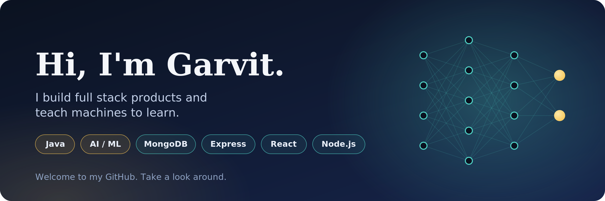

<!-- ===================== BANNER ===================== -->

<p align="center">
  
</p>

<h1 align="center">Hi 👋, I'm Garvit Jain</h1>

<h3 align="center">
  B.Tech CSE Student | Software Developer | Java & DSA | Full Stack Developer | AI Enthusiast
</h3>

<p align="center">
  <a href="https://www.linkedin.com/in/garvit-jain-aa81b128a/">
    
  </a>
  <a href="https://github.com/MASTERGARVIT">
    
  </a>
  <a href="https://mastergarvit.github.io/Portfolio/">
    
  </a>
  <a href="mailto:garvitjain118@gmail.com">
    
  </a>
</p>

---

## 👨‍💻 About Me

I'm a **Computer Science Engineering student** passionate about building software, solving problems, and exploring emerging technologies.

- 🎓 B.Tech in Computer Science & Engineering
- 💻 Currently focusing on **Java, Data Structures & Algorithms**
- 🌐 Building projects with **React, Node.js, Next.js & Spring Boot**
- 🤖 Exploring **AI, LLMs, LangChain & LLMOps**
- ☁️ Interested in **Cloud Computing & DevOps**
- 🧠 Practicing regularly on **LeetCode & GeeksforGeeks**
- 🚀 Interested in **Hackathons, Open Source & Software Development**
- 🎯 Goal: Become a strong **Software Engineer**

---

## 🛠️ Tech Stack

### 👨‍💻 Languages

<p>
  
</p>

### 🌐 Web Development

<p>
  
</p>

### ⚙️ Backend & APIs

<p>
  
</p>

### 🗄️ Databases

<p>
  
</p>

### ☁️ DevOps & Cloud

<p>
  
</p>

### 🤖 AI / Machine Learning

<p>
  
</p>

**Exploring:**

`LangChain` • `LLMs` • `LLMOps` • `LLM Evaluation` • `AI Agents`

---

## 📌 Featured Projects

### 📝 Master Blog

A modern blogging platform where users can create and publish blogs.

**Tech Stack:**

`HTML` `CSS` `JavaScript` `Firebase` `Firestore` `Google Authentication`

🔗 [View Project](YOUR_MASTER_BLOG_LINK)

---

### 💎 Jewellery E-Commerce Platform

A full-stack e-commerce platform for an artificial jewellery business.

**Tech Stack:**

`Next.js` `React` `Node.js` `Prisma` `PostgreSQL` `Tailwind CSS`

🔗 [View Project](YOUR_JEWELLERY_PROJECT_LINK)

---

### 🤖 Agentic Honeypot

An AI-powered cybersecurity project designed to detect and interact with suspicious activity.

**Tech Stack:**

`Python` `FastAPI` `AI` `LLMs` `Docker`

🔗 [View Project](YOUR_AGENTIC_HONEYPOT_LINK)

---

### 🧠 SmartAI

An AI-based project focused on identifying and analyzing misinformation.

**Tech Stack:**

`Python` `AI/ML` `NLP` `LLMs`

🔗 [View Project](YOUR_SMARTAI_LINK)

---

## 🧩 Problem Solving

I regularly practice **Data Structures & Algorithms** to improve my problem-solving and competitive programming skills.

### Platforms

<p align="left">
  <a href="YOUR_LEETCODE_URL">
    
  </a>

  <a href="YOUR_GFG_URL">
    
  </a>
</p>

**Currently practicing:**

`Arrays` • `Strings` • `Recursion` • `Backtracking` • `Linked Lists` • `Stacks` • `Queues` • `Trees` • `Graphs` • `Dynamic Programming`

---

## 📊 GitHub Stats

<p align="center">
  
  
  
</p>

---

## 🔥 GitHub Streak

<p align="center">
  
</p>

---

## 🏆 GitHub Trophies

<p align="center">
  
</p>

---

## 📈 Contribution Graph

<p align="center">
  
</p>

---

## 🚀 What I'm Currently Working On

```text
🔹 Strengthening Data Structures & Algorithms
🔹 Building Full Stack Applications
🔹 Learning AI & LLM Engineering
🔹 Exploring Cloud & DevOps
🔹 Participating in Hackathons
🔹 Building real-world projects
🔹 Preparing for Software Engineering roles
